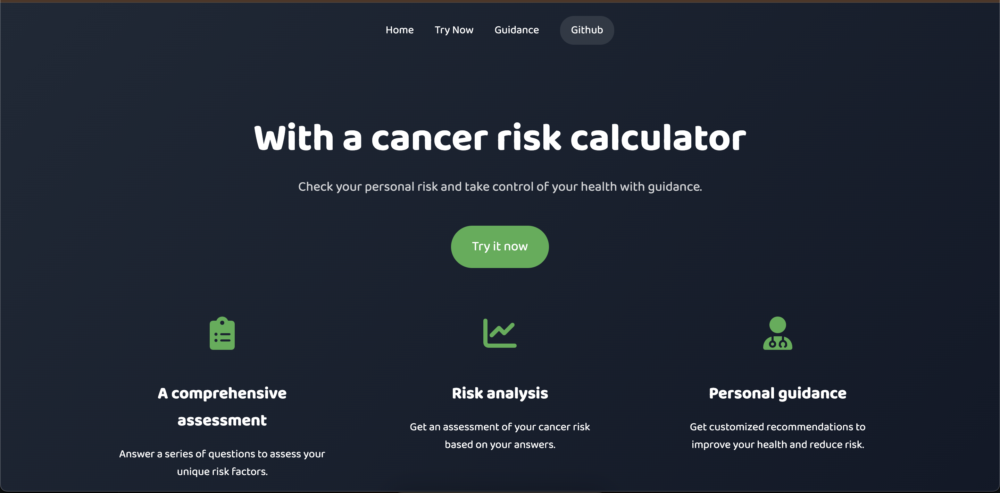
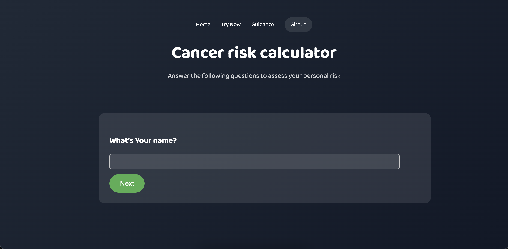
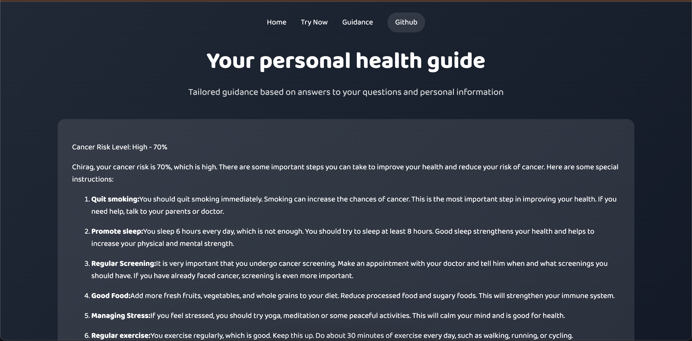
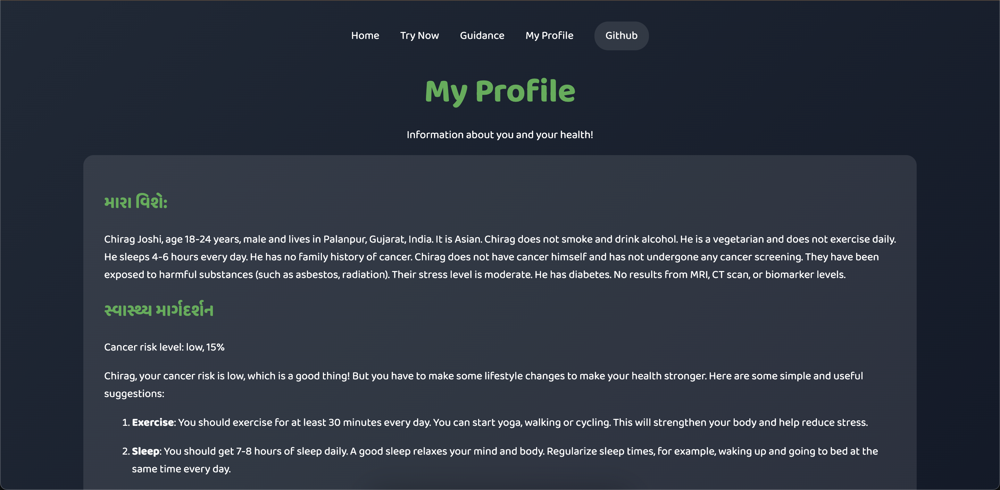

# Cancer Risk Assessment with AI

This project is a web-based application designed to assess cancer risk by generating personalized health-related questions and providing detailed guidance based on user responses.

## Project Structure

- **backend/**: Contains the server-side application code built using Flask.
  - `.env`: Environment variables file containing sensitive data like OPENAI_API_KEY.
  - `app.py`: Main Flask application file.
  - `requirements.txt`: Python dependencies for the backend.

- **frontend/**: Contains the client-side files (HTML) for the user interface.
  - `guidance.html`: Page for personalized health guidance.
  - `index.html`: Homepage of the application.
  - `questions.html`: Page for displaying the questionnaire.

    *frontend was generated by AI.

## Prerequisites

Before running the project, ensure you have the following installed:

- Python 3.8 or above
- pip (Python package installer)
- Node.js (for running the front-end server)

## Installation

### Backend Setup

1. **Clone the repository**:

   ```bash
   git clone https://github.com/princejoshi12/cancer-risk-calculator.git
   cd cancer-risk-assessment/backend
   ```

2. **Install the dependencies:**

   ```bash
   pip install -r requirements.txt
   ```

3. **Configure environment variables:**
    - Copy `.env.example` to `.env`:

    ```bash
    cp .env.example .env
    ```

    - Edit the .env file to include your OpenAI API key:

    ```bash
    OPENAI_API_KEY=your_openai_api_key
    ```

4. **Run the Flask application:**

    ```bash
    python3 app.py
    ```

    The backend server will start on `http://127.0.0.1:5000/`.

### Frontend Setup

1. **Navigate to the `frontend` directory:**

    ```bash
    cd ../frontend
    ```

2. **Run the front-end server:**

    - You can use a simple HTTP server to serve the HTML files. For example, using Python:

    ```bash
    python3 -m http.server 8000
    ```

    The front-end will be accessible at `http://127.0.0.1:8000/`.

## Usage

1. Access the application:

    Open your web browser and navigate to http://127.0.0.1:8000/.

2. Navigate through the application:
    - Home Page: Start by accessing the `index.html` page.
    - Questionnaire: Complete the questionnaire on `questions.html`.
    - Guidance: View personalized guidance on `guidance.html`.

## Screenshots

Here are some screenshots of the application:

- **Home Page:**
  
  
  
- **Questionnaire Page:**
  
  
  
- **Guidance Page:**
  
  

- **My Profile:**
  
  
---

Readme made with 💖 using [README Generator by Chirag Joshi](https://github.com/chiragjoshi12/readme-generator)
